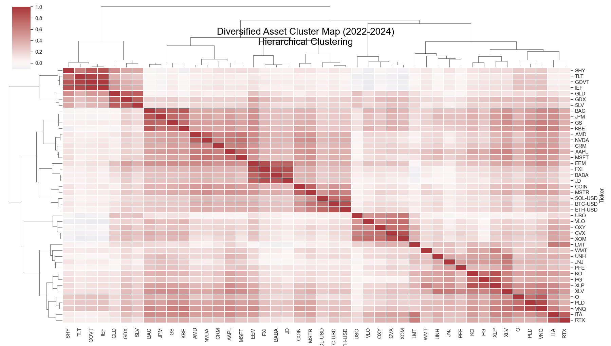

# Asset Correlation & Cluster Analysis

"Am I actually diversified, or am I just lying to myself?"

That was the question I wanted to answer with this project. We all hear that we should "diversify," so we buy 10 different stocks and call it a day. But if those 10 stocks all crash at the exact same time, are you actually safe?

To find out, I built this tool. It doesn't just show a standard correlation chart (which is usually a messy wall of numbers). It uses Unsupervised Machine Learning (Hierarchical Clustering) to physically rearrange the assets into "families," visually proving which investments are actually the same bet in disguise.

## The Objective
To move beyond basic correlation matrices and visually reconstruct market relationships using **Ward’s Method** of hierarchical clustering.
1. **Quantify Relationships:** Compute Pearson correlations across a multi-asset universe.
2. **Cluster Risk:** Group assets that behave identically to reveal multicollinearity.
3. **Visualize Structure:** Render a **Dendrogram** that sorts assets from "Risk-On" to "Safe Haven."

##  Features
* **Multi-Asset Universe:** Analyzes 40+ tickers across Tech, Energy, Crypto, Precious Metals, and Defense.
* **Cluster Map (Dendrogram):** Uses the Ward method to build a tree diagram showing exactly which assets are statistically identical.
* **Sector Matrix:** Aggregates individual stocks into 11 sectors to show macro-level relationships (e.g., "Does Crypto correlate with Tech or Gold?").
* **Targeted Analysis:** Allows the user to input a specific asset (e.g., `BTC-USD`) and generates a ranked bar chart of its top positive and negative correlations.

## 🛠️ Tech Stack
* **Python**
* **yfinance** (Data Ingestion)
* **pandas & numpy** (Statistical Calc)
* **seaborn & scipy** (Clustering & Visualization)

## 🚀 How to Run

1.  **Clone & Install**
    ```bash
    git clone [https://github.com/ClaysonV/Correlation_Cluster_Analysis.git](https://github.com/ClaysonV/Correlation_Cluster_Analysis.git)
    cd Correlation_Cluster_Analysis
    pip install -r requirements.txt
    ```

2.  **Execute**
    ```bash
    python cluster_analysis.py
    ```
    *The script will generate global maps and prompt you for a specific ticker to deep-dive.*

## The "Aha!" Moments (2022-2024 Data)

* **Crypto is just Tech with a fake mustache.** Bitcoin and Ethereum clustered tightly with Nvidia and the Nasdaq. The data shows they are high-beta tech plays, not "Digital Gold."
* **Energy is the rebel.** Oil stocks (XOM, CVX) were among the few assets that actually ignored the Tech crash, validating them as a true diversifier.
* **Bonds are lonely.** TLT (Treasuries) sat in its own isolated corner, proving that the classic 60/40 split still has mathematical merit.

## 📷 Outputs

**1. The Asset Cluster Map**
*See the red blocks? Those are assets moving in lockstep.*


**2. Bitcoin Correlation Profile**
*A targeted look at exactly what moves with BTC.*
